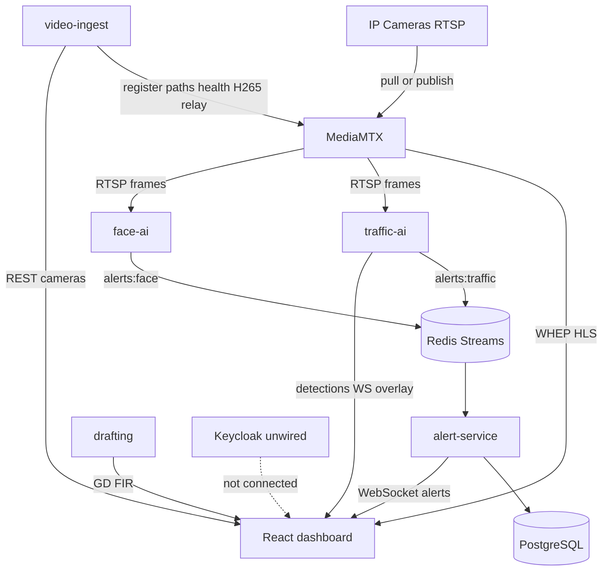

# VMS Intelligence — Architecture Audit

**Project:** `police-ai-starter`  
**Product target:** AI Video Management, Intelligence, Detection & Surveillance Platform  
**Audit date:** 19 August 2026  
**Phase:** 0 — discovery only (no application behavior changes)

This document is the Phase 0 deliverable. It records what the codebase actually does, what already works, what is broken or missing, and a prioritized plan to evolve the system **in place**. It is not a rewrite proposal.

---

## 1. Executive summary

The stack is a working single-tenant surveillance prototype, not a production VMS.

**What is real today**

```text
Camera → MediaMTX → live WHEP/HLS
                 ↘ video-ingest (registry + health)
                 ↘ traffic-ai (YOLO + DeepSORT + traffic zones)
                 ↘ face-ai (watchlist; real path likely broken)
                      → Redis Streams → alert-service → PostgreSQL + WebSocket
                      → React dashboard
```

**What is not real today**

- No API or WebSocket authentication (Keycloak runs unused).
- Camera and database secrets committed / returned to the browser.
- No unified event model, no rule engine, no investigation workflow.
- No recording in the running Docker stack.
- Product copy, schema, and AI rules are police/traffic-specific.

**Verdict:** Preserve the ingest, MediaMTX, YOLO/DeepSORT, Redis, and dashboard live path. Stabilize security and reliability first. Then generalize events/rules and redesign the operator UI. Do not rebuild.

---

## 2. Current architecture

### 2.1 Compose services and ports

Source: [`docker-compose.yml`](docker-compose.yml). PostgreSQL is **external** (not a compose service). Redis is on the compose network only (not published to the host).

| Service | Container | Port | Role |
|---|---|---|---|
| dashboard | `pai_dashboard` | 3000 | React/Vite operator UI |
| video-ingest | `pai_video_ingest` | 8001 | Camera CRUD, MediaMTX sync, RTSP test, snapshots |
| traffic-ai | `pai_traffic_ai` | 8002 | YOLO, DeepSORT, zones, detection WS, MJPEG preview |
| face-ai | `pai_face_ai` | 8003 | InsightFace watchlist matching |
| alert-service | `pai_alert_service` | 8004 | Redis consumer, Postgres persist, WebSocket |
| drafting | `pai_drafting` | 8006 | GD/FIR LLM drafts via Ollama |
| keycloak | `pai_keycloak` | 8080 | Intended RBAC — **not wired** |
| mediamtx | `pai_mediamtx` | 8554 RTSP, 8889 WHEP, 8189 ICE, 8888 HLS, 9997 API | Stream hub |
| nginx | `pai_nginx` | 80 | Incomplete reverse proxy |
| redis | `pai_redis` | 6379 internal | Alert streams + dedup keys |

### 2.2 Data flow



Canonical pipeline:

1. Operator registers a camera via video-ingest (`POST /cameras/connect`).
2. video-ingest writes `cameras` and registers a MediaMTX path (pull URL or publisher).
3. Browser plays live video via WHEP, falling back to HLS. Video does **not** go over WebSocket.
4. traffic-ai pulls `rtsp://mediamtx:8554/<camera_id>` at `CAMERA_FPS` (compose: 10), runs YOLO + DeepSORT + zone analysis, publishes violations to `alerts:traffic`, and broadcasts bbox JSON on `/detections/{id}/ws`.
5. alert-service `XREADGROUP`s Redis, dedups, inserts `alerts`, groups `incidents`, broadcasts `new_alert` on `/ws/{session_id}`.
6. Dashboard tabs consume REST + WebSocket. Officer actions (`accepted` / `rejected` / `escalated` / `closed`) update Postgres and `audit_log`.

### 2.3 APIs (as implemented)

**video-ingest** ([`services/video-ingest/main.py`](services/video-ingest/main.py))

| Method | Path | Purpose |
|---|---|---|
| GET | `/` | Service catalog |
| GET | `/health` | MediaMTX ready count + optional pipeline FPS |
| GET | `/cameras/brands` | RTSP brand templates |
| GET | `/cameras` | Camera list + stream status |
| GET | `/cameras/{id}` | Detail (custom brand still returns `rtsp_url`) |
| POST | `/cameras/connect` | Register pull or publish |
| PATCH | `/cameras/{id}` | Update |
| DELETE | `/cameras/{id}` | Soft-delete + MediaMTX path remove |
| POST | `/cameras/{id}/test` | MediaMTX + ffprobe diagnosis |
| GET | `/cameras/{id}/snapshot` | JPEG snapshot from MediaMTX RTSP |

**alert-service** ([`services/alert-service/main.py`](services/alert-service/main.py))

| Method | Path | Purpose |
|---|---|---|
| GET | `/alerts` | List (includes `snapshot_b64`) |
| POST | `/alerts/{id}/action` | accepted / rejected / escalated / closed |
| GET | `/incidents` | Incident list |
| GET | `/incidents/{id}` | Incident + linked alerts |
| POST | `/incidents/{id}/action` | assigned / dispatched / closed |
| GET | `/analytics/summary` | Today by type / severity / camera |
| GET | `/analytics/violations` | Hourly series (**SQL injection**) |
| GET | `/analytics/camera-stats` | Per-camera counts |
| GET | `/evidence` | Alerts with snapshots |
| POST | `/forensics/search` | Stub — empty results |
| GET | `/system/health` | Broken (`cameras.is_active`) |
| WS | `/ws/{session_id}` | Unauthenticated alert push + catch-up |

**traffic-ai** ([`services/traffic-ai/traffic_ai_worker.py`](services/traffic-ai/traffic_ai_worker.py))

- `GET /health`, Prometheus `/metrics`
- `GET /preview/{camera_id}.mjpg` — annotated MJPEG
- `GET /detections/{camera_id}/ws` — bbox overlay JSON
- `GET /detections/{camera_id}/latest`
- `GET /motion/stats`

**face-ai:** `GET /health` only.  
**drafting:** `POST /draft`, `POST /draft/{id}/approve`, `GET /drafts`.

**Not present:** `/sites`, `/events`, `/rules`, `/zones` (CRUD), `/investigations`, `/users`, authenticated `/health` aggregation.

### 2.4 Database (versioned schema)

Source: [`db/schema.sql`](db/schema.sql). Migrations: [`db/migrations/002_camera_brands.sql`](db/migrations/002_camera_brands.sql), [`db/migrations/003_eyenor_cam1.sql`](db/migrations/003_eyenor_cam1.sql).

**In schema.sql:** `officers`, `cameras`, `watchlist`, `watchlist_faces` (pgvector 512), `alerts`, `incidents`, `alert_search_index` (unused), `drafts`, `audit_log` (immutable trigger), `shifts`.

**Created at runtime, not in schema.sql:**

- `camera_zones` — traffic-ai `CREATE TABLE IF NOT EXISTS` (red_light, stop_line, wrong_lane, no_parking, speed, detection)
- `camera_status` — ingest_pipeline health upsert

**Missing vs target VMS:** `tenants`, `sites`, `areas`, `events`, `ai_rules`, `recordings`, `users` (beyond officers), RBAC tables, retention policies.

Indexes on `alerts`: status, camera_id, created_at DESC, alert_type. No composite (tenant, camera, timestamp, type, severity) because there is no tenant. `alerts.camera_id` is `VARCHAR(20)` with **no foreign key** to `cameras`. API allows camera_id up to 32 characters — mismatch.

### 2.5 Redis

Streams consumed: `alerts:traffic`, `alerts:face`, `alerts:crowd`, `alerts:emergency`.  
Producers exist only for traffic and face. Crowd/emergency streams are empty placeholders.

Consumer group `alert-service`, `XREADGROUP` count 50, block 1s. Success → `XACK`. Failure → log, **no ACK, no dead-letter, no PEL reclaim**.

Dedup: Redis `SET`/`SETEX` keys (`dedup:{type}:{camera}:{track}`) in both AlertPublisher (TTL env) and alert-service (`DEDUP_WINDOW_SECONDS=30`). Double suppression.

`XADD maxlen=10000` (traffic) / `5000` (face). AOF enabled on Redis.

### 2.6 Frontend

- React 18 + Vite 5. No router. Tab state in [`dashboard/src/App.jsx`](dashboard/src/App.jsx).
- All UI in [`dashboard/src/components/index.jsx`](dashboard/src/components/index.jsx) (~1200 lines): CommandCenter, CameraGrid, WhepPlayer, DetectionCanvas, AlertPanel, IncidentList, AnalyticsPage, EvidencePage, AdminPage.
- Hooks in [`dashboard/src/hooks/index.js`](dashboard/src/hooks/index.js).
- Nav: Command Center, Alerts, Cameras, Incidents, Analytics, Evidence, Forensics, GD/FIR, Admin.
- Live: WHEP (`RTCPeerConnection`, no ICE servers) then HLS.js. Overlay via traffic-ai detection WebSocket.
- Branding: “Police Command” / Bangladesh Police, Bangla-first.
- Officer identity: env `VITE_OFFICER_ID` default `operator-001`. No login.
- Dashboard talks to **host ports** (`VITE_ALERT_SERVICE_URL` etc.), not nginx `/api/*`.

---

## 3. What already works (preserve)

Do not replace these because of preference.

| Capability | Evidence |
|---|---|
| Camera registration (pull + publish) | `connect_camera`, brand templates in `camera_urls.py` |
| RTSP diagnosis | ffprobe + Digest handshake; pause MediaMTX retries on 401 to avoid camera lockout |
| MediaMTX path sync | `_register_mediamtx_path`, `_sync_all_cameras_to_mediamtx` |
| H.264 / H.265 ingest | Codec from MediaMTX tracks; H.265 → FFmpeg H.264 `_view` relay |
| Browser live video | WHEP primary, HLS fallback; video not on WebSocket |
| YOLO detection | YOLOv8 TRT → ONNX → PT fallback; COCO 80 + optional BD classes |
| DeepSORT tracking | Per-camera tracker; centroid stub if library missing |
| Traffic zone violations | Shapely polygons / stop line / speed / parking / wrong lane |
| Detection overlay | Structured WS JSON drawn on canvas over live stream |
| Motion skip | Skip YOLO on static frames |
| Alert ingest | Redis consumer groups → Postgres → WS |
| Incident grouping | Same type + camera within a time window |
| Alert actions | accept / reject / escalate / close + audit_log insert |
| Immutable audit table | Triggers block UPDATE/DELETE on `audit_log` |
| Docker deploy | `docker compose up` is the supported path |
| Compose network pin | `172.28.0.0/16` so camera `172.19.1.3` is reachable |

---

## 4. Service inventory (do not delete without evidence)

| Service | Active in compose? | Production-ready? | Verdict |
|---|---|---|---|
| **video-ingest** `main.py` | Yes | Partial | Keep. Core camera lifecycle. Stabilize secrets, never return RTSP URLs. |
| **ingest_pipeline.py** | Started from video-ingest lifespan | Partial | Keep. Writes `camera_status`. AI does **not** consume its queues (`FRAME_SOURCE=rtsp`). |
| **traffic-ai** `traffic_ai_worker.py` | Yes (`CMD`) | Most mature AI | Keep. Do not rewrite YOLO. Abstract event output later. |
| **traffic-ai** `worker.py` | Copied into image; **not** CMD | Legacy mock | **Keep.** Header says do not use. Do not delete. |
| **fine_tune_bd_vehicles.py** | No | Training script | Keep as offline tool. Not a runtime service. |
| **face-ai** `worker.py` | Yes | No (real path broken) | Keep isolated. Compose `MOCK_MODE=false` but image does not include `FrameStream`; `CAMERA_IDS` defaults to `cam01`, not DB. |
| **alert-service** | Yes | Partial | Keep. Harden SQL, snapshots, auth. |
| **drafting** | Yes | Police plugin | Keep isolated. Optional industry pack. Not core VMS nav. |
| **Keycloak** | Yes | Unused | Keep container. Wire in Phase 5. |
| **nginx** | Yes | Incomplete | Fix as HTTPS front door. Dashboard currently bypasses it. |
| **MediaMTX** (compose YAML) | Yes | Live yes, record no | Keep. Dev YAML has `record: false`. Production YAML in `infra/mediamtx/` is **not mounted**. |

---

## 5. Layer analysis

### 5.1 Backend

- **Boundaries:** Reasonable. Ingest owns cameras/MediaMTX; AI owns inference; alert-service owns persistence and fan-out. Drafting is a sidecar. Problem is missing *shared* event/rule layer, not too many services.
- **Error handling:** video-ingest has RTSP-specific messages. alert-service consumer logs and continues. Generic FastAPI 500 handler on ingest.
- **Concurrency:** ingest_pipeline uses multiprocessing per camera; traffic-ai uses asyncio + `run_in_executor` for YOLO/DeepSORT. Default thread pool can stall under many cameras.
- **Async/sync:** Mixed correctly in places (ffprobe subprocess, Digest in executor). Drafting still uses deprecated `@app.on_event("startup")`.
- **Retries:** MediaMTX source retry + ingest backoff (1s→60s) in pipeline. Redis consumer sleeps 2s on loop error. No bounded retry/dead-letter.
- **Config/secrets:** Env-driven URLs. Secrets hardcoded in compose, `.env.example`, MediaMTX YAML, SQL seed.
- **Logging:** traffic-ai JSON structlog + Prometheus. Others: plain `logging`. JWT secret never used.

### 5.2 AI

| Topic | Current behavior |
|---|---|
| Model | YOLOv8; prefers TensorRT engine, then ONNX, then `.pt` (`yolov8m` / `yolov8n` fallback) |
| GPU | Compose `USE_GPU=false` — CPU path. Batch size 1 on CPU, 4 on GPU |
| Inference FPS | `CAMERA_FPS=10` in compose (code default 15). Display is camera FPS via WHEP, not this value |
| Sampling | Motion skip: skip YOLO when no motion; still refresh overlay |
| Pre/post | Ultralytics predict; NMS IoU 0.45; conf 0.35 in compose |
| Tracking | DeepSORT max_age=30, n_init=3; IDs die on worker restart |
| Zones | Traffic-only types; no UI; table created at runtime |
| Duplicate events | Publisher Redis TTL + alert-service TTL |
| Helmet | Heuristic on motorcycle tracks, confidence hardcoded 0.72 |
| ANPR | PaddleOCR; compose `ANPR_ENABLED=false` |
| GPU memory | Not measured. Phase 6 only. |
| Normalized detection | `Detection` dataclass: class_id, class_name, confidence, bbox_xyxy, frame_id, camera_id, timestamp_ms. WS adds track_id + violation. Close to target — **extend, do not replace**. |

No generic counting, entry/exit, loitering, restricted-area, or line-crossing product. `lane_cross_count` exists only inside wrong-lane logic.

### 5.3 Video

| Topic | Current |
|---|---|
| RTSP | TCP pull or camera publish to `rtsp://host:8554/<id>` |
| MediaMTX (running) | [`services/video-ingest/mediamtx.yml`](services/video-ingest/mediamtx.yml): bind all, auth `any`, record false, API on `:9997` |
| MediaMTX (prod file, unused) | [`infra/mediamtx/mediamtx.yml`](infra/mediamtx/mediamtx.yml): VLAN bind, 30-day fmp4 recording, hardcoded camera URL |
| WHEP | Browser POST SDP to `:8889/<id>/whep`. ICE hosts via `MTX_WEBRTCADDITIONALHOSTS` |
| HLS | 7×1s segments, `hlsAllowOrigins: ["*"]` |
| Transcode | H.265 → `<id>_view` H.264 for WHEP |
| Latency | WHEP designed low-latency; HLS ~7s buffer. Not benchmarked |
| Reconnect | MediaMTX source retry; health loop every 15s updates `last_seen_at` |
| Camera health | Dual: `cameras.last_seen_at` + `camera_status` (pipeline). No packet-loss/bitrate/GPU latency metrics |
| Recording | **Off in running stack.** No event pre/post buffers |

### 5.4 Database

- Parameterized queries via asyncpg **except** analytics f-strings.
- `snapshot_b64` TEXT on every alert — unbounded growth.
- No retention job.
- Multi-tenant: not ready. Additive `tenant_id` later; do not rewrite.
- Runtime DDL (`camera_zones`, `camera_status`, `ALTER snapshot_b64`) bypasses migration discipline.
- `GET /system/health` uses `cameras.is_active` — column is `active`.

### 5.5 Redis

Reliable *happy path* delivery (consumer groups + ACK). Missing: PEL reclaim, dead-letter stream, idempotent processing keys beyond TTL dedup, separate detection vs alert streams.

### 5.6 Frontend

| Topic | Current |
|---|---|
| Routing | None — `activeTab` |
| State | Local hooks; 15s camera poll; 30s alert poll + WS |
| WS | Reconnect 3s; ping 25s; unauthenticated |
| Grid performance | Full list rerender on poll; no 1/4/9/16 layouts; no tile memo |
| Overlay toggles | viewMode live / ai / mjpeg — not per-layer (boxes, IDs, zones, trajectories) |
| A11y | Some `aria-label`; color-heavy status; no focus design system |
| Responsive | `useIsMobile(680)`; hamburger sidebar; not a designed mobile ops layout |
| Visual | Dark police command aesthetic; traffic-centric analytics |

---

## 6. Problems (classified)

### Critical

1. **No authentication on APIs or WebSockets.** `JWT_SECRET` loaded, never verified. Keycloak unused. Dashboard hardcodes officer id. Network reachability = full control (register cameras, accept alerts, draft FIRs).
2. **Secrets in git and in API responses.** Plaintext RTSP passwords in `cameras.rtsp_url`. GET camera returns `rtsp_url` for `brand=custom`. Committed camera password in MediaMTX YAML and migration 003. Real `DATABASE_URL` in [`.env.example`](.env.example). Compose `JWT_SECRET` and Keycloak `admin/admin`.
3. **Stream plane published to the host.** Compose publishes RTSP 8554, HLS 8888, WHEP 8889, ICE 8189, MediaMTX API 9997. Dev auth is empty `any` user (publish/read/api/metrics/pprof).
4. **SQL injection** in `analytics_violations` / `analytics_camera_stats` (`camera_id` and `INTERVAL` interpolated into SQL).

### High

5. **face-ai real mode is not deployable as composed.** `MOCK_MODE=false`; worker imports `from video_ingest.main import FrameStream`; image only copies `worker.py`. `CAMERA_IDS` not loaded from DB.
6. **Nginx is not the front door.** Path `/api/cameras` is not rewritten to `/cameras`. Dashboard uses `VITE_*` host ports. No TLS, no security headers, no rate limit.
7. **`GET /system/health` is broken** (`is_active` vs `active`).
8. **Snapshots as base64 in Postgres and WebSocket** — size, latency, no object storage.
9. **No recording in the running stack.** Production recording YAML is unused. No configurable event buffers.
10. **Zero automated tests.**
11. **Redis failure path:** no ACK on error → PEL growth; no DLQ; empty crowd/emergency streams.
12. **README drift.** Documents bundled Postgres, fake camera, auto-applied schema — compose no longer includes those.

### Medium

13. **Police/traffic-hardcoded product** — officers, thana, GD/FIR, NID watchlist, Bangla-first Police Command UI, `SEVERITY_MAP` in Python, zone types traffic-only. No `events` / `ai_rules` / sites / tenants.
14. **Zones have no operator UI**; schema not in `schema.sql`.
15. **No counting / entry-exit / loitering / generic line-crossing.** Track IDs not persistent.
16. **Duplicate health paths** (pipeline `camera_status` vs `last_seen_at`); AI pulls RTSP instead of ingest queues.
17. **Frontend monolith** — no router, one component file, polling rerenders wall, no investigation/timeline/layer toggles.
18. **CORS `allow_origins=["*"]`** on every FastAPI app. No RTSP SSRF allowlist (any URL accepted — expected for cameras, needs CIDR policy).
19. **Observability uneven** — only traffic-ai is structured + Prometheus.

### Low

20. ingest_pipeline queues unused by AI.
21. Forensic search stub; `alert_search_index` unused.
22. Drafting deprecated FastAPI startup hook.
23. Helmet presented as fact, not heuristic.
24. `fine_tune_bd_vehicles.py` is not a service.

### Future (explicitly out of scope until later)

Full multi-tenancy, MFA, PPE/OCR engines, heatmaps, Kubernetes, extra brokers, new UI framework, treating face detection as identity.

---

## 7. Risks

| Risk | Why it matters |
|---|---|
| Credential rotation | If this repo was pushed or shared, rotate DB user password and camera accounts. Treat `.env.example` as a leak. |
| Schema rewrite | Dropping police tables to “go generic” will break drafting, watchlist, and officers. Use additive nullable `tenant_id` / `site_id`. |
| Face identification | Watchlist matching is legally sensitive. Keep detection ≠ identity; default off; human review. |
| Premature FPS tuning | Compose is CPU, 10 FPS. Measure in Phase 6 before changing inference rate. |
| Big-bang UI rewrite | WHEP + overlay are the working operator path. Incremental IA/CSS; keep `WhepPlayer` and detection WS. |
| Dual MediaMTX configs | Editing `infra/mediamtx/mediamtx.yml` does not change Docker. Compose mounts `services/video-ingest/mediamtx.yml`. |
| Alert spam vs safety | 30s dedup is not correlation. Restricted-zone “3 persons” does not exist yet. |

---

## 8. Gap vs target product

Target pipeline: Camera → Live → Detect → Track → Context → Rule → Event → Severity → Alert → Human action → Investigate → Analytics.

| Target capability | Status | Notes |
|---|---|---|
| Connect cameras | Working | Brands, pull/publish, test |
| Watch live | Working | WHEP + HLS |
| Detect | Working | YOLO; traffic-coupled events |
| Track | Partial | DeepSORT in-process only |
| Understand / context | Missing | No generic attributes, dwell, counts |
| Rules | Missing | Hardcoded `SEVERITY_MAP` + zone types |
| Unified events | Missing | Only `alerts` |
| Severity from rules | Missing | Python maps |
| Alert center | Partial | Accept/reject/escalate; no assign/investigate/note |
| Investigation | Missing | Forensics stub |
| Analytics | Partial | Today/24h charts; traffic-labeled |
| Recording | Missing in run stack | Unused prod YAML |
| Camera health | Partial | live/offline; no bitrate/loss/GPU |
| RBAC | Schema only | Not enforced |
| Multi-tenant | Missing | |
| Industry-agnostic UI | Missing | Police Command |
| Overlay layer toggles | Partial | live/ai/mjpeg only |
| Object counting | Missing | |
| Zone drawing UI | Missing | |

**Recommended internal detection shape** (evolve existing, do not fork):

```json
{
  "camera_id": "cam01",
  "timestamp_ms": 1718000000000,
  "object_type": "person",
  "track_id": 123,
  "confidence": 0.91,
  "bbox": [x1, y1, x2, y2],
  "zone_id": null,
  "attributes": {}
}
```

This matches `Detection` + WS payload more closely than introducing a new parallel model.

---

## 9. Recommended architecture (smallest evolution)

Keep current processes. Add a **data model and rule layer**, not new brokers or services.

```text
IP Cameras
    │
    ▼
MediaMTX ──► Live WHEP/HLS ──► Browser
    │
    ▼
AI workers (pluggable engines, shared Detection)
    │
    ▼
Event engine (normalize, dedup, correlate)     ← Phase 3, inside alert-service first
    │
    ▼
Rule engine (DB-backed severity and WHEN/THEN) ← Phase 3
    │
    ▼
Redis Streams → alert-service → PostgreSQL + notifications + WebSocket
    │
    ▼
VMS Dashboard
```

- Do not add Kafka, extra microservices, or a new frontend framework.
- Put event normalization in alert-service (and a shared Python module later) rather than a new “event-engine” container.
- Drafting and watchlist become **feature packs**, not core navigation.
- Nginx becomes the only browser-facing HTTP/WS entry; MediaMTX RTSP and API stay on the private network.
- Recording: enable MediaMTX fmp4 behind config in compose/prod; event clips after continuous recording works.

---

## 10. Implementation plan

### Phase 0 — this document (complete when committed)

- `ARCHITECTURE_AUDIT.md` (this file)
- Interactive audit canvas (IDE sidecar)
- **No application behavior changes**

### Phase 1 — Stabilize foundation

Focus: camera lifecycle, MediaMTX, API reliability, secrets hygiene, nginx, health bugs. Preserve YOLO/DeepSORT/WHEP/overlays.

**Files expected to change**

| File | Why |
|---|---|
| [`docker-compose.yml`](docker-compose.yml) | Secrets from env; stop publishing RTSP/API 8554/9997 where possible; document WHEP ICE |
| [`.env.example`](.env.example) | Placeholders only — remove real DSN |
| [`infra/nginx.conf`](infra/nginx.conf) | Rewrite `/api/cameras` → `/cameras`; proxy alerts/WS/ingest/detections; security headers |
| [`services/video-ingest/main.py`](services/video-ingest/main.py) | Never return RTSP URL/password; username redact; password write-only |
| [`services/video-ingest/mediamtx.yml`](services/video-ingest/mediamtx.yml) | Remove hardcoded camera password; rely on ingest API registration |
| [`services/alert-service/main.py`](services/alert-service/main.py) | Parameterized SQL; `is_active` → `active`; omit `snapshot_b64` from list endpoints |
| [`db/schema.sql`](db/schema.sql) + new migration | Promote `camera_zones` and `camera_status` |
| [`README.md`](README.md) / new `SECURITY.md` | Ports, env, threat notes |

**Operational (not code):** rotate DB password; rotate camera accounts; treat leaked DSN as an incident if the repo is remote.

**Exit criteria:** compose config valid; health endpoints truthful; camera register/test/live still work; overlay still works; alert WS still works; dashboard build succeeds; credentials no longer in API JSON or git templates.

### Phase 2 — AI pipeline

**Status: implemented.** Keep YOLOv8 + DeepSORT. Configurable inference FPS per camera (`cameras.inference_fps`, else `CAMERA_FPS`). Normalized detection WS (`object_type`, `track_id`, `zone_id`, `attributes`). Counting, line crossing, dwell from existing tracks. Zone types `restricted`, `counting_line`. Zone CRUD on video-ingest. Do not add PPE/OCR engines until events exist (Phase 3).

### Phase 3 — Event intelligence

**Status: implemented.** Additive `events` + `ai_rules`. Producer severity is ignored; severity comes from rules only. Correlate (“3 persons in restricted zone” → `restricted_crowd`). Alert lifecycle: acknowledge, assign, investigate, resolve, note. Redis PEL reclaim + `alerts:dead` / `alert_dead_letters` after bounded retries.

### Phase 4 — Dashboard redesign — **done**

Keep React/Vite. Rebrand **VMS Intelligence**. Nav: Overview, Live, Alerts, Cameras, Events, Investigation, Analytics, Administration. Preserve `WhepPlayer` + detection overlay; add layer toggles. Command center, camera detail, alert center, timeline. Police GD/FIR behind Administration / industry pack. Incremental split of `components/index.jsx`. Use UI/UX Pro Max before visual redesign.

### Phase 5 — Security and enterprise — **done**

Wire Keycloak; backend-authoritative RBAC; WebSocket auth; camera/site permissions; audit completeness; face privacy defaults; nullable `tenant_id` without breaking single-tenant.

### Phase 6 — Measure then optimize — **done**

Benchmark camera count, AI FPS, GPU/CPU/RAM, stream/event/DB/WS latency, frontend FPS. Only then change `CAMERA_FPS`, batching, WS coalescing, list virtualization.

---

## 11. Constraints (every phase)

- Do not rebuild. Do not add Kafka, Kubernetes, or a new UI framework.
- Do not delete [`services/traffic-ai/worker.py`](services/traffic-ai/worker.py).
- Do not send video frames over WebSocket or REST (snapshots/overlays only).
- Schema changes via migrations only. No destructive production data rewrites.
- After each phase: compose validation, health checks, camera register/live, AI overlay, alert WS, dashboard build.
- Do not invent capabilities the stack cannot support without labeling them Future.

---

## 12. Implementation status

Phase 0–5 are in the tree. **Phase 6 (measure then optimize) is complete:** `/health` exposes camera count, AI FPS, inference/ingest/WS latency, CPU/RSS (GPU via pynvml when present); overlay FPS in the status bar. CPU `CAMERA_FPS` stays **10** (raise only when GPU inference p95 is under 50ms). Latest-frame batching; detection WS coalesced at 150ms; alert/event lists virtualized. Live WHEP tiles are not virtualized.

No further numbered phases in this plan.
